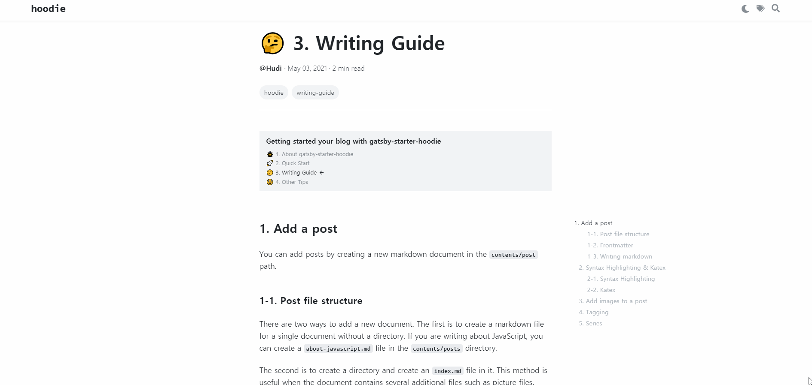

<h1 align="center">
    Hoodie
</h1>

<h4 align="center">
  A gatsby theme developed for developers to write tech blogs.
</h4>



## 🚀 About gatsby-starter-hoodie

[한국어 문서 바로가기](https://github.com/devHudi/gatsby-starter-hoodie/blob/develop/README-kr.md)

gatsby-starter-hoodie is a gatsby theme created for writing tech blogs. Markdown, Code Highlighting in various programming languages, and Katex syntax are supported. Also, you can easily categorize articles into tags and series.

Start your blog with a neatly designed gatsby-starter-hoodie that supports dark mode.

## Live Demo

[https://devHudi.github.io/gatsby-starter-hoodie](https://devHudi.github.io/gatsby-starter-hoodie)

## Features

- Markdown
- Code Highlighting
- Katex Syntax
- Dark Mode (Responsive to the settings of the OS)
- Tag Categoriazation
- Series Categorization
- Responsive Web
- SEO
- Utterance (Comment widget)

Getting started your blog with gatsby-starter-hoodie by following steps below. It's very easy 😉.

## 1. Create a Gatsby site

> Make sure you have **node.js** and **gatsby-cli** installed on your computer.

```
$ npx gatsby new my-hoodie-blog https://github.com/devHudi/gatsby-starter-hoodie
```

## 2. Start dev server

```
$ cd my-hoodie-blog
$ npm run start
```

Now you can access to your blog at localhost:8000.

## 3. Create your own Github repository

Utterance comment widget is based on **Github issue system**. So you need your own GitHub repository. Also, if you want to publish your blog through Github Pages or Netlify, the Github Repository is a necessary.

If you don't know how to create a GitHub repository, follow the [official GitHub documentation](https://docs.github.com/en/github/getting-started-with-github/create-a-repo).

### Add remote repository

```
git remote add origin https://github.com/{YOUR_GITHUB_NAME}/{YOUR_REPOSITORY_NAME}
```

## 4. Write blog-config.js

```javascript
module.exports = {
  title: "MY BLOG",
  description: "Hello, This is my blog",
  author: "YOUR NAME",
  siteUrl: "https://myblog.com",
  links: {
    github: "https://github.com",
    facebook: "https://www.facebook.com",
    instagram: "https://www.instagram.com",
    etc: "https://www.google.com/",
  },
  utterances: {
    repo: "{YOUR_GITHUB_NAME}/{YOUR_REPOSITORY_NAME}",
    type: "pathname",
  },
}
```

gatsby-starter-hoodie provides a configuration file called `blog-config.js`. In this file, you can configure blog, biography (profile), and utterance.

Configure `blog-config.js` to suit your blog. However, it is recommended not to modify `utterances.type`.

## 5. Add your content

Markdown content is in `contents/posts`. You can write and add your articles. [Click here](https://devHudi.github.io/gatsby-starter-hoodie/writing-guide) to see the detail writing guide.

## 6. Deploy your blog

### 6-1 via Netlify

<a href="https://app.netlify.com/start/deploy?repository=https://github.com/alxshelepenok/gatsby-starter-lumen" target="_blank"></a>

Follow the Connecting to Netlify steps in [A Step-by-Step Guide: Gatsby on Netlify](https://www.netlify.com/blog/2016/02/24/a-step-by-step-guide-gatsby-on-netlify/). It's not difficult.

If you connect the github repository using Netlify, it is automatically distributed whenever you push it, so it is convenient.

### 6-2. via Github Pages

#### Case 1

If the repository name is in the form of `{YOUR_GITHUB_NAME} .github.io`, run it below.

```
$ npm run deploy-gh
```

#### Case 2

If the repository name is not in the form of `{YOUR_GITHUB_NAME} .github.io`, run it below.

```
$ npm run deploy-gh-prefix-paths
```

In the above case, you need to change `pathPrefix` in `gatsby-config.js` to your repository name.

### 6-3. other platforms

```
$ npm run build
```

You can build the gatsby website with the command above. The build output is created in the `/public` directory. Deploy the `/public` directory using the command for the platform you want to deploy.

## 7. Cutomize

### Project Structure

You can customize your own gatsby-starter-hoodie by referring to the following file structure 🙊.

```
├── node_modules
├── contents
│   └── posts // your articles are here
├── public // build outputs are here
└── src
    ├── assets
    │   └── theme // theme config is here
    ├── components
    │   └── Article
    │       └── Body
    │           └── StyledMarkdown
    │               └── index.jsx // markdown styles are here
    │   ...
    ├── fonts // webfonts are here
    ├── hooks
    ├── images
    ├── pages // page components are here
    ├── reducers
    ├── templates // post components are here
    └── utils
```
